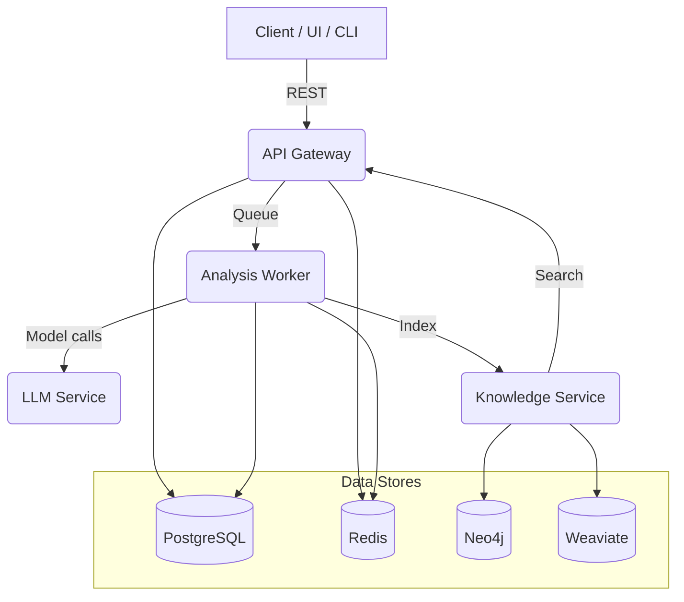

# Architecture Overview

This document provides a high-level overview of the CodeSage Platform architecture.

## Core Services

- **API Gateway** (FastAPI): exposes REST endpoints for ingesting code, running analysis, and querying results.
- **Analysis Worker** (Celery): performs static analysis, security scanning, and performance checks.
- **LLM Service**: hosts model inference endpoints used by analysis and knowledge services.
- **Knowledge Service**: indexes code and analysis results into a graph/vector store (Neo4j + Weaviate) for semantic search.

## Service Interaction (High Level)

## Observability

- **Metrics**: exported via Prometheus (HTTP endpoints are exposed by each service)
- **Tracing**: Jaeger collects distributed traces across API + workers
- **Logging**: logs are emitted to console (stdout) and can be aggregated by a log collector (e.g., Loki)

## Notes

- The API uses **JWT** for authentication; tokens are issued by the auth router.
- The analysis pipeline is asynchronous: request -> queue -> worker -> persistence.
- The LLM service is intentionally separated to allow swapping models (local or remote).
